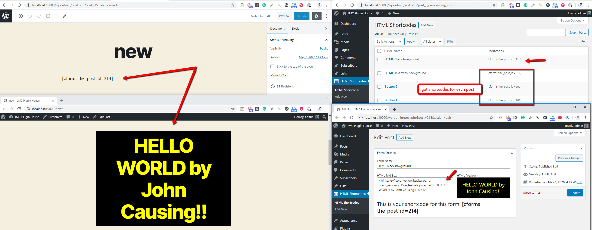

Description: This is a WordPress plugin generates shortcodes for each post from the custom post type 'causing_forms. It creates a shortode when WordPress loads (init) then it loops inside that shortcode creation to get each post id and pass it to shortcode arguments / parementers.

This is the hear of this plugin:

add_action( 'init', 'causing_forms_query' );

function causing_forms_query() {
 	add_shortcode('cforms', 'cforms_scode'); 
}

function cforms_scode( $attr, $content="") {
	//  get and loop all posts of custom post type 'causing_forms'

}

Author: John Mark Causing

Author URI:  http://causingdesignscom.kinsta.cloud/

